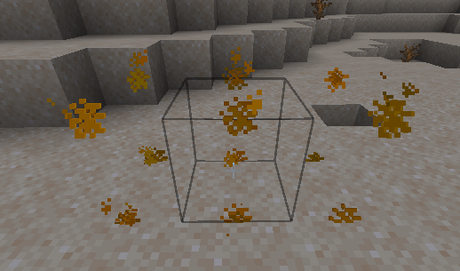

# Столкновения с мебелью

### Как сделать мебель из массива?

Вы можете сделать мебель твердой, добавив атрибут "solid" и указав хитбокс (если вы хотите > 1x1x1).

```yaml
  table:
    display_name: display-name-table
    permission: table
    lore:
      - 'lore-decorative-item'
    resource:
      material: OAK_WOOD
      generate: false
      model_path: item/table
    behaviours:
      furniture:
        small: true
        solid: true
        entity: armor_stand
        hitbox:
          length: 1
          width: 1
          height: 1
          length_offset: 0
          width_offset: 0
          height_offset: 0
```

.png>)

## Хитбокс имеет неправильное расположение <a href="#show-the-hitbox" id="show-the-hitbox"></a>


Иногда необходимо также указать "смещение", чтобы зафиксировать местоположение хитбокса.\
Это может произойти, если ваша мебель, например, 2x1x1.


### Неправильное расположение хитбокса



### Правильное расположение <a href="#show-the-hitbox" id="show-the-hitbox"></a>

.png>)

Мне пришлось установить смещение по ширине 0.5.\
Вы также можете использовать отрицательные значения, если это необходимо.

```yaml
        hitbox:
          length: 1
          width: 2
          height: 1
          width_offset: 0.5
```

## Предварительный просмотр хитбокса <a href="#show-the-hitbox" id="show-the-hitbox"></a>


Вы можете использовать команду `/iahitbox`, чтобы увидеть хитбокс при создании мебели, это очень полезно для обнаружения ошибок в настройке хитбокса.


 (2) (3) (2) (1) (1) (1) (1) (1) (1) (1) (1) (1) (1) (1) (1) (2) (3).png>)

.png>)

.png>)


## Ограничения хитбоксов

### `item_frame` ограничения (не влияет на `armor_stand`)

**Мебель**, в которой используется `entity: item_frame` **поддерживает только хитбокс** с `width` и `length` **одного и того же значения**. \
Пример: `width: 2`, `length: 2`, `height: 1`.&#x20;

\
Если вы хотите иметь разные `width` и `length`, используйте `entity: armor_stand`.


