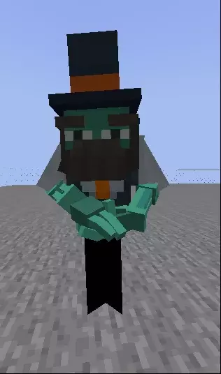
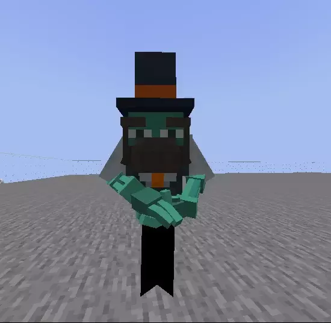

# Citizens

## Cоздание NPC

Вы можете использовать пользовательскую модель в качестве скина для любого Citizens NPC.


Для работы этого плагина не требуется Citizens, но на некоторых серверах может потребоваться его использование для создания NPC.


### Изменение модели

Установите тип NPC на `ZOMBIE`: \
`/npc type ZOMBIE`


Не используйте `PLAYER` в качестве типа, это вызывает проблемы с поворотом головы/тела.


Затем измените скин с помощью команды **ItemsAdder**:\
`/iaentity citizens <id|selected> model <model>`\
``В данном примере: `/iaentity citizens <id|selected> model custom:barman_robot`

### Отключение звуков

Вы можете отключить звук NPC с помощью этой команды, более подробная информация на [Citizens wiki](https://wiki.citizensnpcs.co/Commands).\
`/npc sound -n`

### Заставьте голову вращаться

Вы можете заставить NPC смотреть на игроков поблизости, используя эту команду, более подробная информация на [Citizens wiki](https://wiki.citizensnpcs.co/Commands).\
`/npc look`

### Выполнено

## Воспроизведение анимации

С помощью этой команды можно воспроизвести анимацию: `/iaentity citizens <id|selected> anim play <animation>`

